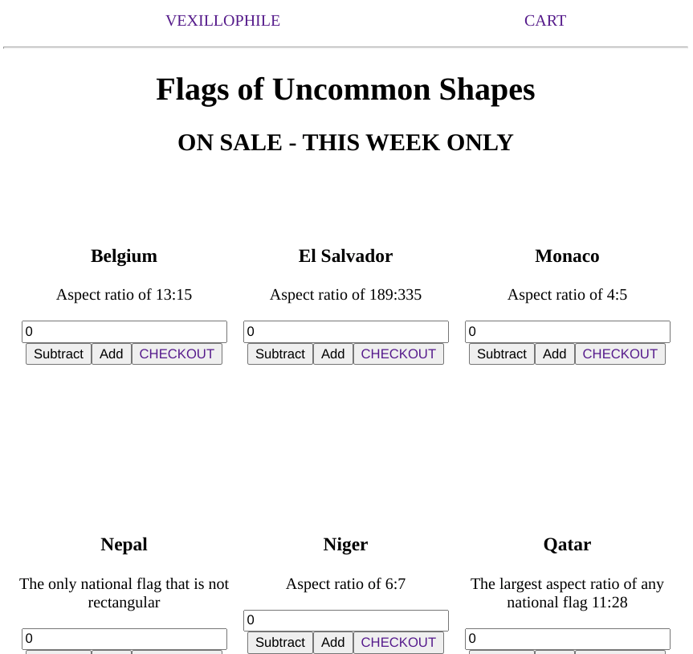

# Shopping Cart

[Odin Project](https://web.archive.org/web/20210227084900/https://theodinproject.com/courses/javascript/lessons/shopping-cart)

## Table of contents

- [Overview](#overview)
  - [Screenshot](#screenshot)
- [My process](#my-process)
  - [Built with](#built-with)
  - [Requirements](#requirements)
  - [What I learned](#what-i-learned)
  - [Useful resources](#useful-resources)

## Overview

[Live Link](https://jdegand.github.io/odin-project-shopping-cart)

### Screenshot

## My process

### Built with

- React
- React Router

### Requirements 

- [x] Create a new project with create-react-app and get rid of the boilerplate as in the previous projects.
- [x] You should have at least have two pages (a homepage and a shop page, which includes your shopping cart). 
- [x] Let a user navigate between the pages with a navigation bar, which will be shown on both routes.
- [ ] On your shopping cart route, a user should see a sticky bar (it can be just a top section as well), which displays the number of items currently in the cart. You should also have a button next to it where you can go to the cart to checkout and pay (however we are not going to implement this logic here).
- [x] Build individual card items for each of your products. Display an input field on it. Add an increment and decrement button. Display a title for each product and an “Add To Cart” button.
- [x] Once a user has submitted their order, the amount on the cart itself should adjust.

### What I learned

- I should have better documented my code at the start.  I was doing these challenges as quick as possible and neglected to add better readmes.

- I used browser router but I should have switched to hashrouter for github pages.

- I had to do some fiddling to set the value to the correct property. 

- I had to comment out the flag images.  I think the site became unreliable and it may have moved domains around the time I did this.   

### Useful resources

- [Dev.to](https://dev.to/jeremypersing/add-country-flags-to-your-app-with-this-api-countryflagsio-alternative-d0d) - add flags with this api
